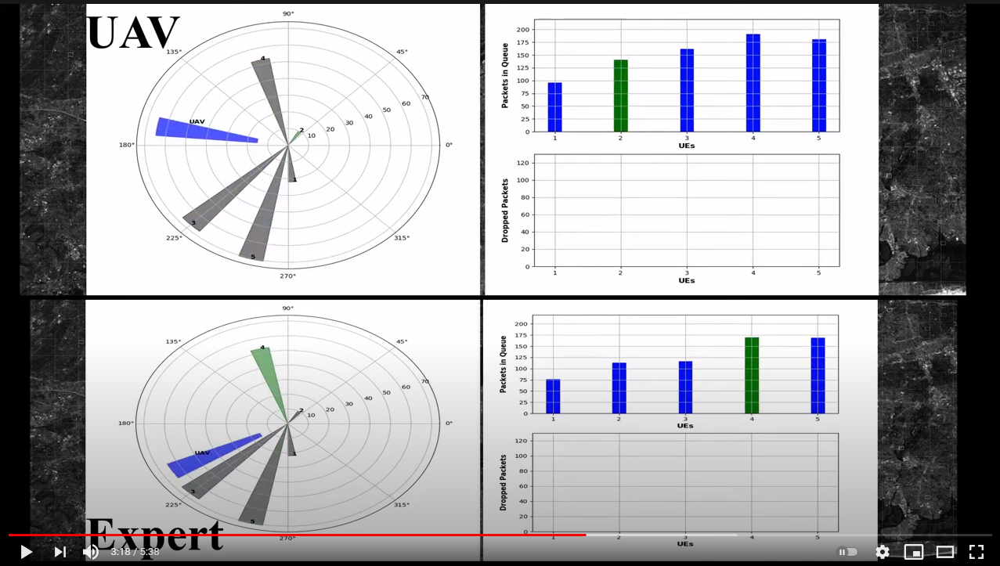

# Imitation Learning (Behavioral-Cloning) for UAV-Assisted Communication in Remote Disaster Area
An Autonomous UAV Assisted Communication is Remote Disaster Area using Imitation Learning (Behavioral Cloning)

## Paper
<!--- just ou can find the **article** related to this code [here at IEEE](https://ieeexplore.ieee.org/abstract/document/8824917) or --->
You can find the **preprint** related to this repository from [Arxiv](...) (Pending).

Abstract: The damage to cellular towers during natural and man-made disasters can disturb the communication services for cellular users. One solution to the problem is using unmanned aerial vehicles to augment the desired communication network. The paper demonstrates the design of a UAV-Assisted Imitation Learning (UnVAIL) communication system that relays the cellular users’ information to a neighbor base station. Since the user equipment (UEs) are equipped with buffers with limited capacity to hold packets, UnVAIL alternates between different UEs to reduce the chance of buffer overflow, positions itself optimally close to the selected UE to reduce service time, and uncovers a network pathway by acting as a relay node. UnVAIL utilizes Imitation Learning (IL) as a data-driven behavioral cloning approach to accomplish an optimal scheduling solution. Results demonstrate that UnVAIL performs similar to a human expert knowledge-based planning in communication timeliness, position accuracy, and energy consumption with an accuracy of 97.52% when evaluated on a developed simulator to train the UAV.


<!--- * The system model of this paper is based on:
 <br/> --->

* The sytem model and imitation model are based on experts data for Queues and UEs:<br/>

<!---<br/> --->

* The supervised machine learning model to clone the expert behavior:<br/>


## Code
This code is run and tested on Python 3.6 on both linux machine with no issues. 


## Required Packages


## Results

* A short sample video of the simulator we designed is available on YouTube:<br/>
[](https://youtu.be/xYSlZac-AMM "Sample video")

* Performance evavluation (Accuracy and Loss) for Training, Vlidation, and Test sets:<br/>
<br/>

* Confusion matrix of true and predicted UEs during the test set for UnVAIL (Imitated Model):<br/>
<!--- <br/> --->


* Performance comparison (EDT) for expert and the imitated model:<br/>
<!---  --->


For more results please refer to our paper.

## Citation
If you find the code or the article useful, please cite our paper using this BibTeX:
```
...
```


## License
For academtic and non-commercial usage 
